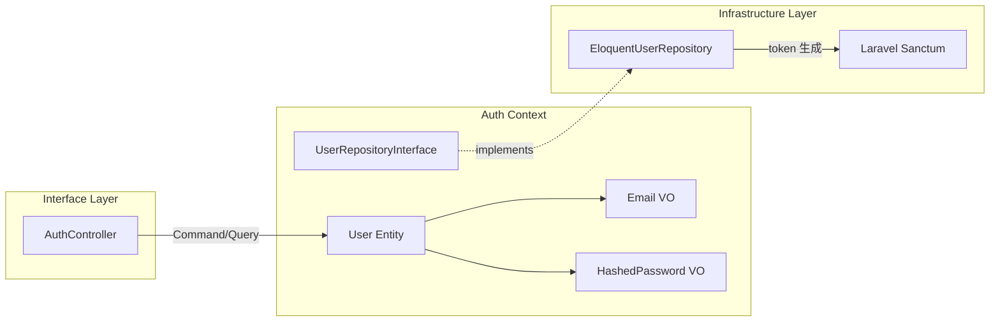
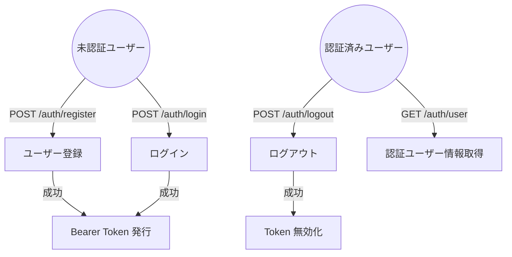
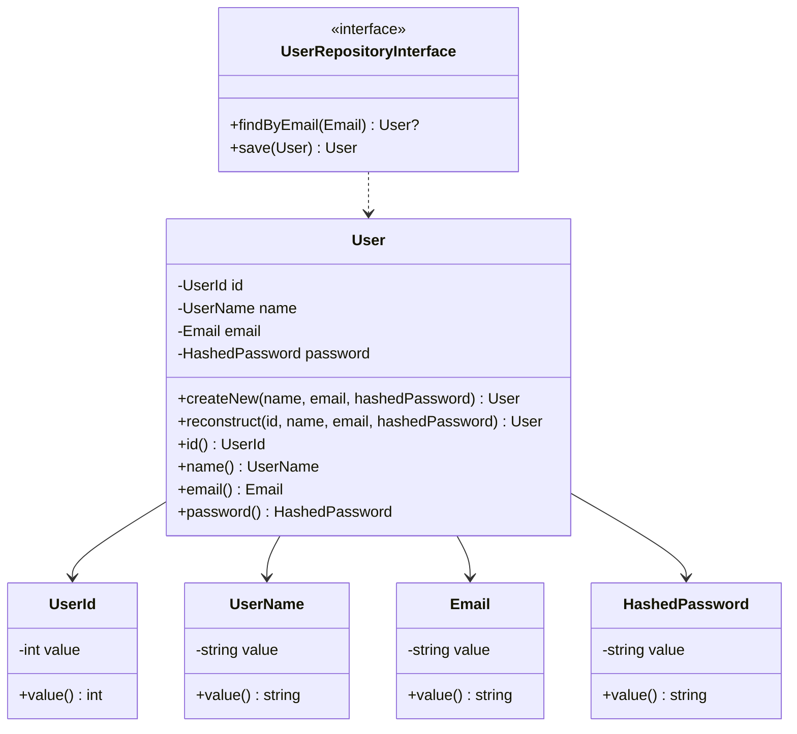
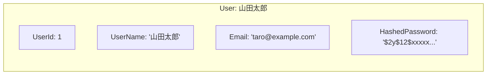

# Auth ドメインモデル（ユーザー認証・登録）

## 1. ドメイン境界と目的
- 対象となる業務
    - ユーザーアカウントの登録、ログイン、ログアウト、認証状態の管理
- 目的
    - アプリケーション利用者を一意に識別し、安全な認証手段を提供する
- モデルとしての考え方
    - User は「認証のための存在」であり、家族管理や記録といった他コンテキストの関心事は持たない。パスワードは平文でドメイン層に入らず、常にハッシュ済みの状態で扱う

## 2. 業務上の構成要素（概念モデル）
認証は、次のような単位で構成される。

- **User（ユーザー）**: メールアドレスとパスワードで識別されるアカウント
- **Email（メールアドレス）**: ユーザーを一意に識別する連絡先
- **HashedPassword（ハッシュ化パスワード）**: bcrypt でハッシュ化済みの認証情報
- **Bearer Token（アクセストークン）**: ログイン後の認証に使用する一時的なトークン（Sanctum 管理）

## 3. システム関連図

## 4. ユースケース図

## 5. 関係する業務ルール

| ルール | 説明 |
|---|---|
| メールアドレスの一意性 | 同一メールアドレスで複数アカウントは作成できない |
| パスワード最低文字数 | パスワードは8文字以上 |
| パスワードのハッシュ化 | 平文パスワードは Domain 層に入らない。Application 層で bcrypt ハッシュ化し、HashedPassword として渡す |
| トークンの有効性 | トークンは明示的にログアウト（削除）されるまで有効。有効期限なし（Phase 1） |
| 認証エラー | メールまたはパスワードが不正な場合、具体的にどちらが間違っているかは返さない（セキュリティ配慮） |

## 6. ビジネス側から見た主な操作

| 操作 | Command / Query | 処理概要 |
|---|---|---|
| ユーザー登録 | `RegisterUserCommand` | Email 重複チェック → パスワードハッシュ化 → User 生成 → 永続化 → Token 発行 |
| ログイン | `LoginCommand` | Email で User 検索 → パスワード照合 → Token 発行 |
| ログアウト | `LogoutCommand` | 現在のアクセストークンを削除 |
| ユーザー情報取得 | `GetCurrentUserQuery` | 認証済みユーザーの情報を Eloquent で直接取得（CQRS Query 側） |

## 7. 代表的な不変条件（業務上、常に成り立たせたいこと）

- `Email` は有効なメール形式であること（`filter_var` による検証）
- `UserName` は1〜255文字であること
- `UserId` は正の整数であること
- `HashedPassword` は bcrypt ハッシュ済み文字列であること
- 同一メールアドレスを持つ User は1つだけ存在する

## 8. 今後検討したい業務ルール（メモ）

- パスワードリセット機能（Phase 1 スコープ外）
- メール認証（email_verified_at の活用、Phase 1 スコープ外）
- トークンの有効期限設定
- ログイン試行回数の制限（レートリミット）
- ソーシャルログイン対応

## 9. ドメインモデル図

## 10. オブジェクト図（具体例）

**登録シナリオ**:
1. 入力: `name='山田太郎'`, `email='taro@example.com'`, `password='password123'`
2. RegisterUserHandler が Email 重複チェック → なし
3. `password123` を bcrypt ハッシュ化 → `HashedPassword('$2y$12$xxxxx...')`
4. `User::createNew(UserName('山田太郎'), Email('taro@example.com'), HashedPassword('$2y$12$xxxxx...'))` で生成
5. `UserRepository::save()` で永続化 → `UserId(1)` が採番される
6. Sanctum で Bearer Token 発行 → `1|abcdefghijklmnop...`
