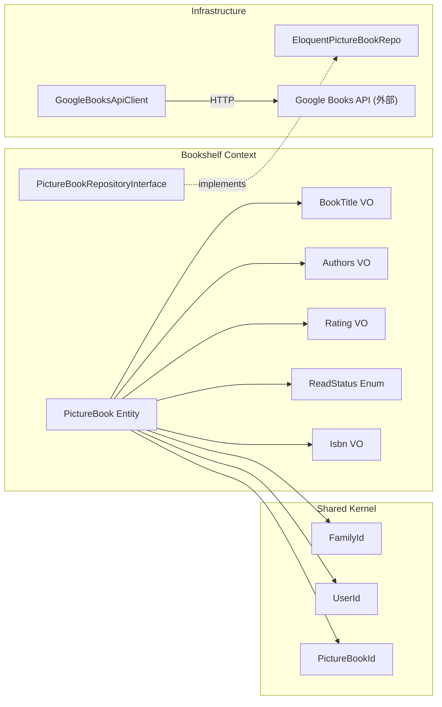
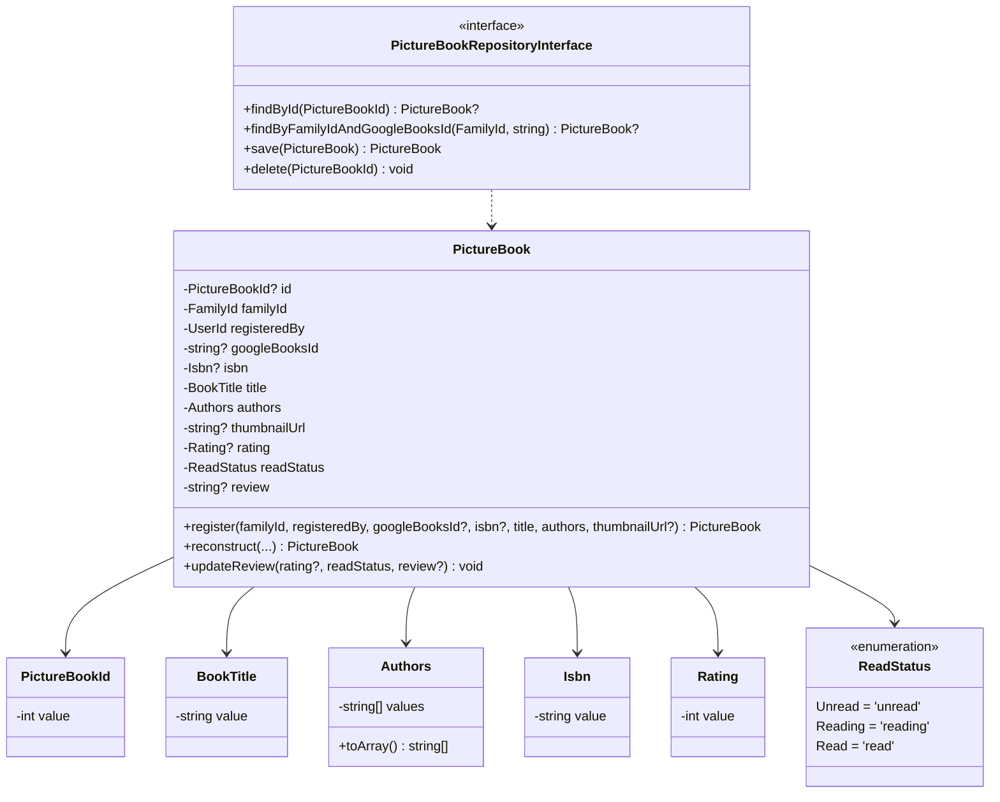
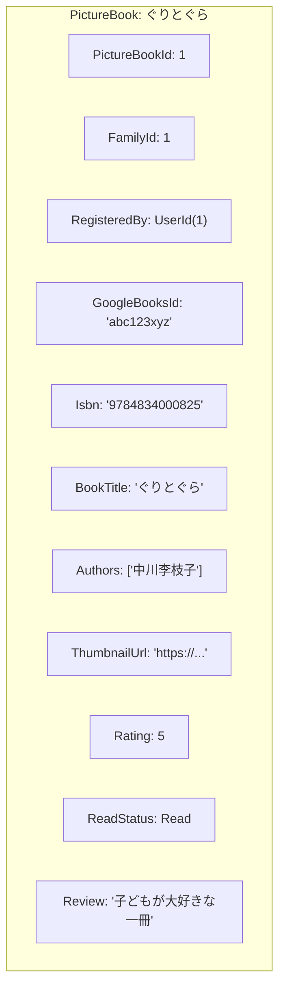

# Bookshelf ドメインモデル（絵本登録・本棚管理）

## 1. ドメイン境界と目的
- 対象となる業務
    - 絵本の検索（Google Books API）、家族の本棚への登録、評価・読書ステータス・レビューの管理
- 目的
    - 家族ごとの絵本コレクション（本棚）を管理し、読み聞かせ記録の対象となる絵本マスタを提供する
- モデルとしての考え方
    - PictureBook は「家族の本棚にある1冊」を表し、Google Books API からの情報と家族独自の評価・ステータスを統合して保持する。外部 API（Google Books）はインフラ層の関心事であり、ドメイン層には影響しない

## 2. 業務上の構成要素（概念モデル）
本棚管理は、次のような単位で構成される。

- **PictureBook（絵本）**: 本棚に登録された1冊の絵本。集約ルートかつスタンドアローン
- **BookTitle（タイトル）**: 絵本のタイトル
- **Authors（著者）**: 絵本の著者リスト（複数著者対応）
- **Isbn（ISBN）**: 書籍の国際標準図書番号
- **Rating（評価）**: 1〜5段階の評価
- **ReadStatus（読書ステータス）**: 未読 / 読書中 / 読了の3状態
- **GoogleBooksApiClient**: Google Books API への検索プロキシ（インフラ層）

## 3. システム関連図



## 4. ユースケース図

```mermaid
graph TB
    Member((家族メンバー))

    Member -->|GET /books/search?q=...| UC1[Google Books で絵本を検索する]
    Member -->|POST /families/{id}/books| UC2[絵本を本棚に追加する]
    Member -->|GET /families/{id}/books| UC3[本棚一覧を表示する]
    Member -->|GET /families/{id}/books/{id}| UC4[絵本の詳細を表示する]
    Member -->|PUT /families/{id}/books/{id}| UC5[評価・ステータス・レビューを更新する]
    Member -->|DELETE /families/{id}/books/{id}| UC6[絵本を本棚から削除する]

    UC1 -->|検索結果から選択| UC2
    UC2 -->|重複チェック| Check{同家族に同一\ngoogle_books_id?}
    Check -->|Yes| Error[エラー: 既に登録済み]
    Check -->|No| Save[本棚に登録]
```

## 5. 関係する業務ルール

| ルール | 説明 |
|---|---|
| 家族単位の本棚 | 絵本は家族ごとに管理される。他家族の本棚にはアクセスできない |
| 重複登録防止 | 同一家族内で同じ `google_books_id` を持つ絵本は2冊登録できない |
| 手動登録の許容 | Google Books にない絵本は `google_books_id` なしで手動登録可能。手動登録には重複チェックなし |
| 初期ステータス | 本棚に追加した時点の read_status は `unread`（未読） |
| 評価の任意性 | rating は任意。登録時は null、後からユーザーが設定 |
| 著者の柔軟性 | 著者は JSON 配列で保存。空配列（著者不明）も許容 |
| サムネイル URL の正規化 | Google Books の `http://` URL は `https://` に変換して保存 |
| 登録者の追跡 | 誰が本棚に追加したかを `registered_by` で記録。ユーザー削除時は null になる |

## 6. ビジネス側から見た主な操作

| 操作 | Command / Query | 処理概要 |
|---|---|---|
| 絵本検索 | `SearchGoogleBooksQuery` | GoogleBooksApiClient で外部 API 検索 → DTO に変換して返却 |
| 絵本追加 | `AddBookCommand` | google_books_id 重複チェック → PictureBook.register() → 永続化 |
| 評価・ステータス更新 | `UpdateBookCommand` | PictureBook 取得 → updateReview() → 永続化 |
| 絵本削除 | `RemoveBookCommand` | PictureBook 削除（関連する read_records も cascade 削除） |
| 本棚一覧取得 | `ListBooksQuery` | Eloquent 直接取得。read_status フィルター、ソート、ページネーション対応 |
| 絵本詳細取得 | `GetBookQuery` | Eloquent 直接取得 |

## 7. 代表的な不変条件（業務上、常に成り立たせたいこと）

- `BookTitle` は1〜500文字であること
- `Authors` は文字列の配列であること（空配列を許容）
- `Isbn` は ISBN-10 または ISBN-13 の形式であること（ハイフンなし数字列）
- `Rating` は1〜5の整数であること（null 許容）
- `ReadStatus` は `unread` / `reading` / `read` のいずれかであること
- `PictureBook` は必ず1つの Family に属すること（`family_id` は必須）
- 同一家族内で `google_books_id` が重複する PictureBook は存在しない（google_books_id が non-null の場合）

## 8. 今後検討したい業務ルール（メモ）

- 読み聞かせ記録の作成に連動した read_status の自動更新（Phase 1 では手動のみ）
- 絵本の soft delete（削除後も記録データとの整合性を保つ）
- Google Books API キーの設定（レート制限対策）
- 著者での検索・フィルター機能
- 絵本のお気に入り機能
- 本棚のカテゴリ・棚分け機能

## 9. ドメインモデル図



## 10. オブジェクト図（具体例）



**絵本登録→評価更新シナリオ**:
1. 太郎が Google Books で「ぐりとぐら」を検索 → `SearchGoogleBooksQuery(keyword='ぐりとぐら')`
2. 検索結果から選択し `AddBookCommand(familyId=1, userId=1, googleBooksId='abc123xyz', isbn='9784834000825', title='ぐりとぐら', authors=['中川李枝子'], thumbnailUrl='https://...')` を実行
3. 重複チェック: family_id=1 で google_books_id='abc123xyz' の本はなし → OK
4. `PictureBook::register()` で生成（readStatus=Unread, rating=null, review=null）
5. 後日、太郎が `UpdateBookCommand(bookId=1, rating=5, readStatus='read', review='子どもが大好きな一冊')` を実行
6. `PictureBook::updateReview()` で評価・ステータス・レビューを更新
