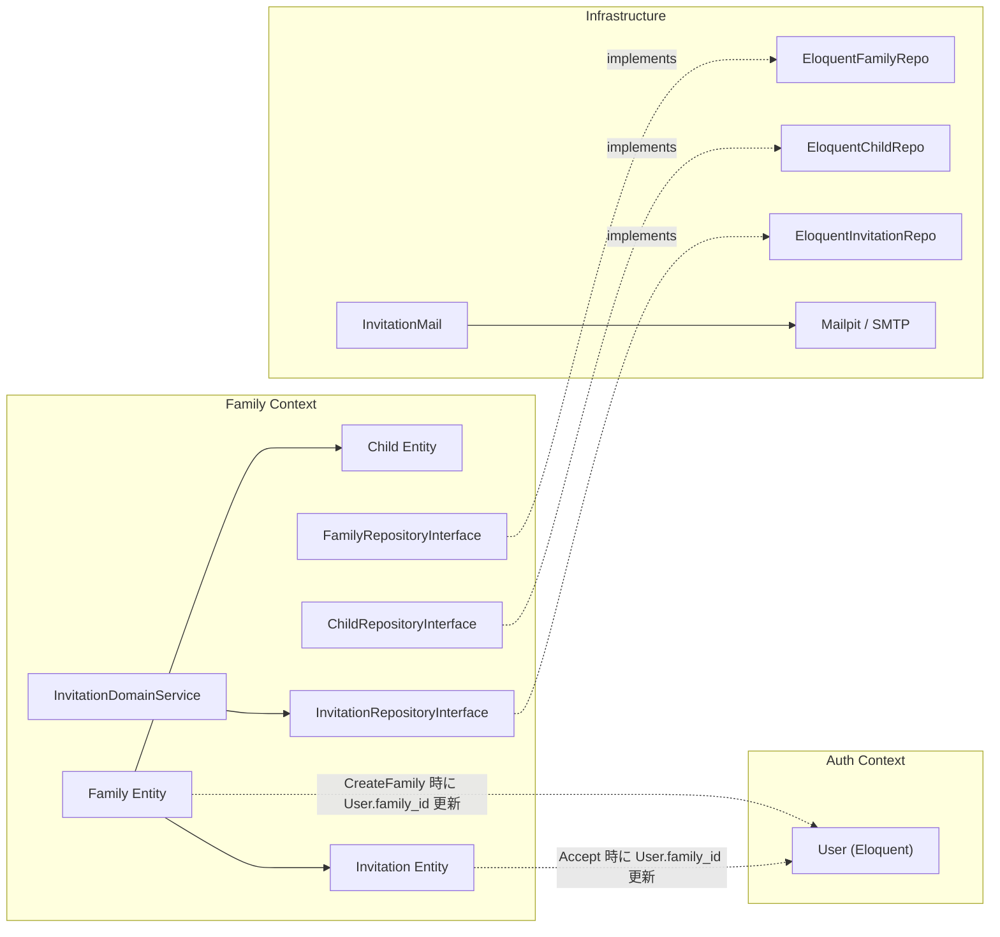
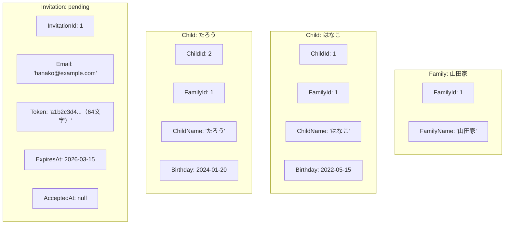

# Family ドメインモデル（家族管理・子ども・招待）

## 1. ドメイン境界と目的
- 対象となる業務
    - 家族グループの作成・編集、子どもの登録・管理、家族メンバーの招待・参加
- 目的
    - 絵本読み聞かせの記録を家族単位で共有するための基盤を提供する。家族という単位でデータのアクセス境界を定義する
- モデルとしての考え方
    - Family は本アプリにおけるデータ共有の最小単位（テナント）。本棚や記録はすべて Family に紐づく。Child は Family の構成要素であり、読み聞かせの対象者。Invitation は家族にメンバーを追加するための一時的なプロセスを表す

## 2. 業務上の構成要素（概念モデル）
家族管理は、次のような単位で構成される。

- **Family（家族）**: 本棚・記録を共有するグループ。集約ルート
- **Child（子ども）**: 家族に属する読み聞かせの対象者。名前と誕生日を持つ
- **Invitation（招待）**: 既存の家族メンバーが新しいメンバーを招待するプロセス。トークンと有効期限を持つ
- **InvitationDomainService（招待ドメインサービス）**: 招待作成の複合ロジック（重複チェック・トークン生成・期限設定）を管理

## 3. システム関連図



## 4. ユースケース図

```mermaid
graph TB
    Member((家族メンバー))
    Invitee((招待されたユーザー))
    NewUser((家族未所属ユーザー))

    NewUser -->|POST /families| UC1[家族を作成する]
    Member -->|PUT /families/{id}| UC2[家族名を変更する]
    Member -->|GET /families/{id}| UC3[家族情報を取得する]
    Member -->|GET /families/{id}/members| UC4[メンバー一覧を取得する]
    Member -->|POST /families/{id}/children| UC5[子どもを登録する]
    Member -->|PUT /families/{id}/children/{id}| UC6[子ども情報を編集する]
    Member -->|DELETE /families/{id}/children/{id}| UC7[子どもを削除する]
    Member -->|GET /families/{id}/children| UC8[子ども一覧を取得する]
    Member -->|POST /families/{id}/invitations| UC9[メンバーを招待する]
    Member -->|GET /families/{id}/invitations| UC10[招待一覧を取得する]
    Member -->|DELETE /families/{id}/invitations/{id}| UC11[招待をキャンセルする]
    Invitee -->|POST /invitations/{token}/accept| UC12[招待を受理する]
```

## 5. 関係する業務ルール

| ルール | 説明 |
|---|---|
| 1ユーザー1家族 | ユーザーは同時に1つの家族にのみ所属できる（Phase 1） |
| 家族作成は未所属者のみ | 既に家族に所属しているユーザーは新しい家族を作成できない |
| 子どもの誕生日制約 | 誕生日は過去の日付のみ許容（未来日は不可） |
| 認可は家族所属ベース | 家族のリソースにアクセスできるのは、その家族のメンバーのみ |
| ロール不問 | Phase 1 では全メンバーが等しい権限を持つ（管理者の概念なし） |
| 招待の重複防止 | 同一家族・同一メールアドレスに対して、未処理の招待は1つまで |
| 招待の有効期限 | 招待は作成から7日間有効 |
| 自己招待の禁止 | 自分自身のメールアドレスへの招待は不可 |
| 既メンバーへの招待禁止 | 既に同じ家族に所属しているユーザーへの招待は不可 |
| 招待受理はログイン必須 | 招待を受理するにはアカウントを持ちログインしている必要がある |
| 家族所属済みユーザーの受理不可 | 既に別の家族に所属しているユーザーは招待を受理できない |

## 6. ビジネス側から見た主な操作

| 操作 | Command / Query | 処理概要 |
|---|---|---|
| 家族作成 | `CreateFamilyCommand` | Family 生成 → 永続化 → 作成者の family_id を設定 |
| 家族名変更 | `UpdateFamilyCommand` | Family 取得 → rename → 永続化 |
| 子ども追加 | `AddChildCommand` | Child 生成 → 永続化 |
| 子ども更新 | `UpdateChildCommand` | Child 取得 → update → 永続化 |
| 子ども削除 | `RemoveChildCommand` | Child 削除 |
| 招待送信 | `SendInvitationCommand` | DomainService で重複チェック・Invitation 生成 → 永続化 → メール送信 |
| 招待受理 | `AcceptInvitationCommand` | Token で Invitation 取得 → accept() → User.family_id 更新 |
| 招待キャンセル | `CancelInvitationCommand` | Invitation 削除 |
| 家族情報取得 | `GetFamilyQuery` | Eloquent 直接取得（CQRS Query 側） |
| メンバー一覧 | `ListMembersQuery` | Eloquent 直接取得 |
| 子ども一覧 | `ListChildrenQuery` | Eloquent 直接取得 |
| 招待一覧 | `ListInvitationsQuery` | Eloquent 直接取得（ステータス算出付き） |

## 7. 代表的な不変条件（業務上、常に成り立たせたいこと）

- `FamilyName` は1〜255文字であること
- `ChildName` は1〜255文字であること
- `Birthday` は過去の日付であること（未来日不可）
- `FamilyId`, `ChildId`, `InvitationId` は正の整数であること
- `InvitationToken` は64文字の英数字であること
- 招待は `pending`（未処理）/ `accepted`（受理済み）/ `expired`（期限切れ）のいずれかの状態にある
- 期限切れまたは受理済みの招待は受理できない
- 受理済みの招待はキャンセルできない
- `users.family_id` は nullable（未所属状態を許容）

## 8. 今後検討したい業務ルール（メモ）

- 家族メンバーのロール（管理者/一般メンバー）による権限分離
- 家族脱退機能（Phase 1 では提供しない）
- 家族削除時のデータ移行・エクスポート
- 子ども削除時の読み聞かせ記録への影響（cascade vs soft delete）
- 招待の自動削除スケジュールタスク（期限切れ招待のクリーンアップ）
- ユーザーが複数家族に所属するケース（多対多への移行）
- メールの非同期送信（キュー化）

## 9. ドメインモデル図

```mermaid
classDiagram
    class Family {
        -FamilyId? id
        -FamilyName name
        +create(name) Family
        +reconstruct(id, name) Family
        +rename(name) void
        +id() FamilyId?
        +name() FamilyName
    }

    class Child {
        -ChildId? id
        -FamilyId familyId
        -ChildName name
        -Birthday? birthday
        +create(familyId, name, birthday?) Child
        +reconstruct(id, familyId, name, birthday?) Child
        +update(name, birthday?) void
    }

    class Invitation {
        -InvitationId? id
        -FamilyId familyId
        -UserId invitedBy
        -Email email
        -InvitationToken token
        -DateTimeImmutable? acceptedAt
        -DateTimeImmutable expiresAt
        +create(familyId, invitedBy, email, token, expiresAt) Invitation
        +accept() void
        +isExpired() bool
        +isAccepted() bool
        +isPending() bool
    }

    class InvitationDomainService {
        -InvitationRepositoryInterface invitationRepo
        +createInvitation(familyId, invitedBy, email) Invitation
    }

    class FamilyId {
        -int value
    }
    class FamilyName {
        -string value
    }
    class ChildId {
        -int value
    }
    class ChildName {
        -string value
    }
    class Birthday {
        -DateTimeImmutable value
    }
    class InvitationId {
        -int value
    }
    class InvitationToken {
        -string value
        +generate()$ InvitationToken
        +fromString(string)$ InvitationToken
    }

    class FamilyRepositoryInterface {
        <<interface>>
        +findById(FamilyId) Family?
        +save(Family) Family
    }

    class ChildRepositoryInterface {
        <<interface>>
        +findById(ChildId) Child?
        +findByFamilyId(FamilyId) Child[]
        +save(Child) Child
        +delete(ChildId) void
    }

    class InvitationRepositoryInterface {
        <<interface>>
        +findById(InvitationId) Invitation?
        +findByToken(InvitationToken) Invitation?
        +findPendingByFamilyIdAndEmail(FamilyId, Email) Invitation?
        +findByFamilyId(FamilyId) Invitation[]
        +save(Invitation) Invitation
        +delete(InvitationId) void
    }

    Family --> FamilyId
    Family --> FamilyName
    Child --> ChildId
    Child --> FamilyId
    Child --> ChildName
    Child --> Birthday
    Invitation --> InvitationId
    Invitation --> FamilyId
    Invitation --> InvitationToken
    InvitationDomainService --> InvitationRepositoryInterface
```



## 10. オブジェクト図（具体例）



**家族作成→招待→受理シナリオ**:
1. 太郎（UserId: 1, family_id: null）が `CreateFamilyCommand(name='山田家', userId=1)` を実行
2. Family(id=1, name='山田家') が作成され、太郎の `family_id = 1` に更新
3. 太郎が `SendInvitationCommand(familyId=1, invitedBy=1, email='hanako@example.com')` を実行
4. InvitationDomainService が重複チェック → なし → Invitation 生成 → メール送信
5. 花子（UserId: 2, family_id: null）がメールリンクからアクセス
6. `AcceptInvitationCommand(token='a1b2c3d4...', userId=2)` を実行
7. Invitation.accept() → 花子の `family_id = 1` に更新 → 招待の `accepted_at` を記録
