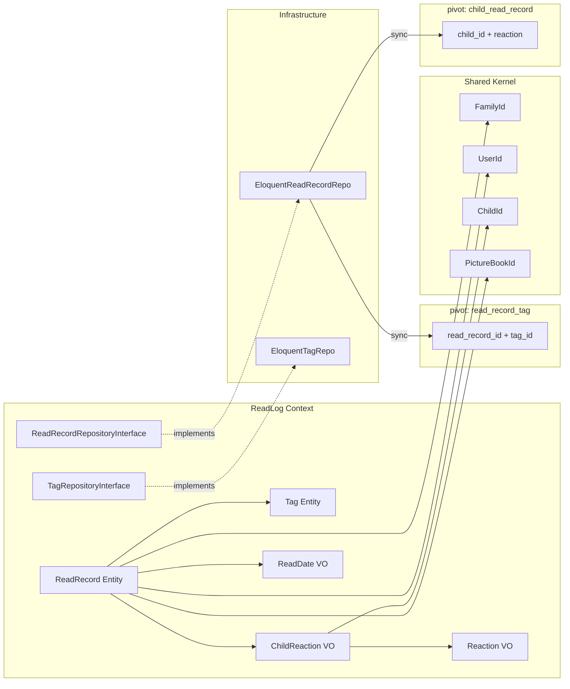
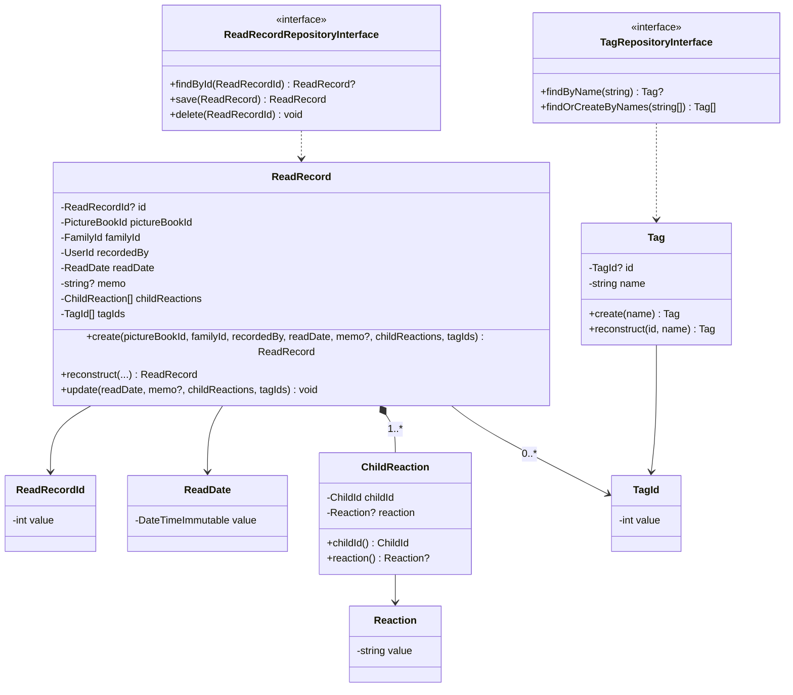
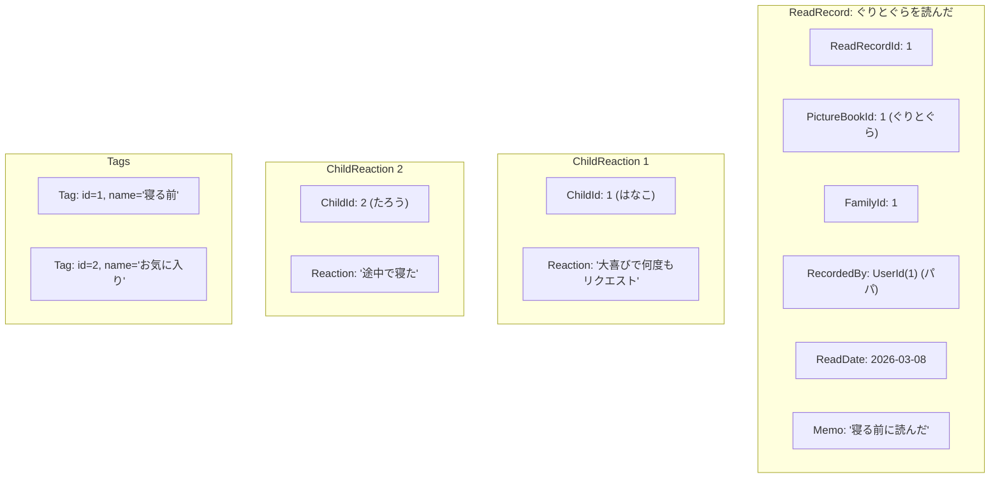

# ReadLog ドメインモデル（読み聞かせ記録）

## 1. ドメイン境界と目的
- 対象となる業務
    - 絵本の読み聞かせ記録の作成・編集・削除、子どもごとのリアクション記録、タグによる分類
- 目的
    - いつ、誰に、どの絵本を読み聞かせたかを記録し、子どもの反応やメモを残すことで、家族の読書体験を振り返れるようにする
- モデルとしての考え方
    - ReadRecord は「1回の読み聞かせセッション」を表す集約ルート。1つの絵本に対して複数の子どもに読み聞かせ、それぞれの反応を記録できる。Tag はグローバルに共有される分類ラベルで、記録の整理・検索に使う

## 2. 業務上の構成要素（概念モデル）
読み聞かせ記録は、次のような単位で構成される。

- **ReadRecord（読み聞かせ記録）**: 1回の読み聞かせセッション。集約ルート
- **ChildReaction（子どもリアクション）**: 読み聞かせに参加した子どもとそのリアクションのペア（値オブジェクト）
- **Tag（タグ）**: 記録を分類するラベル（「寝る前」「お気に入り」など）
- **ReadDate（読んだ日）**: 読み聞かせを行った日付
- **Reaction（リアクション）**: 子どもの反応を表す自由テキスト

## 3. システム関連図



## 4. ユースケース図

```mermaid
graph TB
    Member((家族メンバー))

    Member -->|POST /families/{id}/records| UC1[読み聞かせを記録する]
    Member -->|GET /families/{id}/records| UC2[記録一覧を表示する]
    Member -->|GET /families/{id}/records/{id}| UC3[記録詳細を表示する]
    Member -->|PUT /families/{id}/records/{id}| UC4[記録を編集する]
    Member -->|DELETE /families/{id}/records/{id}| UC5[記録を削除する]
    Member -->|GET /tags?q=...| UC6[タグを検索する]

    UC1 -->|子ども選択| Children[複数の子どもを選択\n各自のリアクションを入力]
    UC1 -->|タグ入力| Tags[既存タグをサジェスト\n新規タグも作成可能]
    UC2 -->|フィルター| Filter[子ども / 絵本 / 期間\nで絞り込み]
```

## 5. 関係する業務ルール

| ルール | 説明 |
|---|---|
| 家族単位のアクセス | 記録は家族ごとに管理。他家族の記録にはアクセスできない |
| 子ども最低1人 | 記録には最低1人の子どもが必要（「誰に読んだか」が核心情報） |
| 子どもの所属チェック | 指定された子どもは、記録を作成する家族に属していること |
| 絵本の所属チェック | 指定された絵本は、記録を作成する家族の本棚に存在すること |
| 読んだ日の制約 | read_date は今日または過去の日付のみ（未来日不可） |
| リアクションは自由テキスト | 定義済み選択肢ではなく、ユーザーが自由に入力（最大255文字） |
| タグはグローバル | タグは全家族で共有。他家族が作ったタグ名も検索候補に出る |
| タグの自動作成 | 存在しないタグ名が指定された場合、自動的に新規作成される |
| 子どもの重複禁止 | 1つの記録に同じ子どもを2回以上紐付けできない |
| 記録削除時のタグ保持 | 記録を削除してもタグマスタ自体は削除されない（ピボットのみ削除） |
| 絵本削除時のcascade | 絵本が削除されると、関連する記録も cascade で削除される |

## 6. ビジネス側から見た主な操作

| 操作 | Command / Query | 処理概要 |
|---|---|---|
| 記録作成 | `CreateRecordCommand` | タグの findOrCreate → ChildReaction 配列構築 → ReadRecord.create() → 永続化（ピボット sync） |
| 記録更新 | `UpdateRecordCommand` | ReadRecord 取得 → タグの findOrCreate → ReadRecord.update() → 永続化（ピボット sync） |
| 記録削除 | `DeleteRecordCommand` | ReadRecord 削除（cascade でピボットも削除） |
| 記録一覧 | `ListRecordsQuery` | Eloquent 直接取得。child_id / picture_book_id / 日付範囲フィルター。Eager load: children, tags, pictureBook |
| 記録詳細 | `GetRecordQuery` | Eloquent 直接取得。全リレーション Eager load |
| タグ検索 | `SearchTagsQuery` | 前方一致で検索（オートコンプリート用） |

## 7. 代表的な不変条件（業務上、常に成り立たせたいこと）

- `ReadDate` は今日以前の日付であること
- `Reaction` は0〜255文字であること
- `ChildReaction` は `ChildId` と `Reaction?` のペアであること
- `ReadRecord` には最低1つの `ChildReaction` が存在すること
- 同一 `ReadRecord` 内に同じ `ChildId` の `ChildReaction` は重複しない
- `Tag.name` はシステム全体で一意であること
- `ReadRecord` は必ず1つの `PictureBook` と1つの `Family` に属すること
- `ReadRecordId`, `TagId` は正の整数であること

## 8. 今後検討したい業務ルール（メモ）

- read_status の自動更新（記録作成時に紐づく絵本のステータスを `reading` や `read` に変更）
- リアクションのサジェスト機能（よく使うリアクションを提案）
- タグの家族スコープ化（`tags.family_id` の追加）
- 記録の統計・集計機能（月間読書数、子どもごとの読書傾向）
- 記録のカレンダー表示
- 写真・音声の添付機能
- 記録のソーシャル共有機能

## 9. ドメインモデル図



## 10. オブジェクト図（具体例）



**記録作成シナリオ**:
1. パパ（UserId: 1）が「ぐりとぐら」（PictureBookId: 1）の読み聞かせを記録する
2. `CreateRecordCommand` を実行:
   - `pictureBookId=1, familyId=1, userId=1`
   - `readDate='2026-03-08'`
   - `memo='寝る前に読んだ'`
   - `childReactions=[{child_id: 1, reaction: '大喜びで何度もリクエスト'}, {child_id: 2, reaction: '途中で寝た'}]`
   - `tags=['寝る前', 'お気に入り']`
3. CreateRecordHandler:
   - `TagRepository::findOrCreateByNames(['寝る前', 'お気に入り'])` → Tag(1), Tag(2)（'寝る前' は既存、'お気に入り' は新規作成）
   - `ChildReaction` 配列を構築
   - `ReadRecord::create()` でエンティティ生成
   - `ReadRecordRepository::save()` で永続化
     - `read_records` テーブルにレコード挿入
     - `child_read_record` ピボットに2件挿入（各子どものリアクション付き）
     - `read_record_tag` ピボットに2件挿入（タグ紐付け）

**記録更新シナリオ**（子どもの追加・リアクション変更）:
1. パパが記録を更新: たろうを外し、リアクションを変更
2. `UpdateRecordCommand` を実行
3. `ReadRecord::update()` で値を更新
4. `ReadRecordRepository::save()` で `sync()` によりピボットテーブルを一括更新
